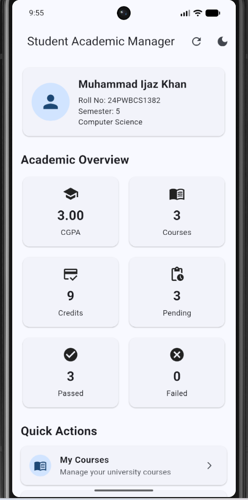
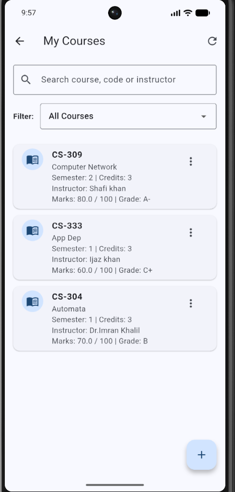
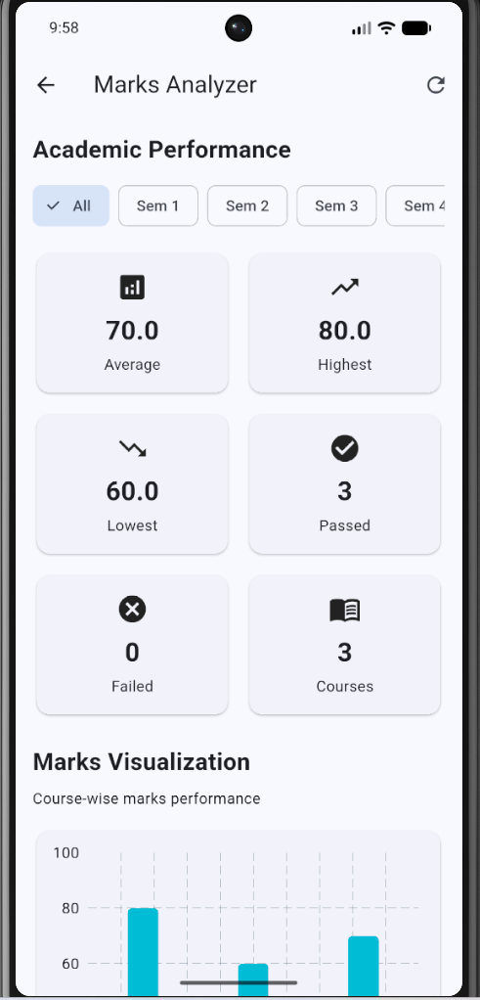
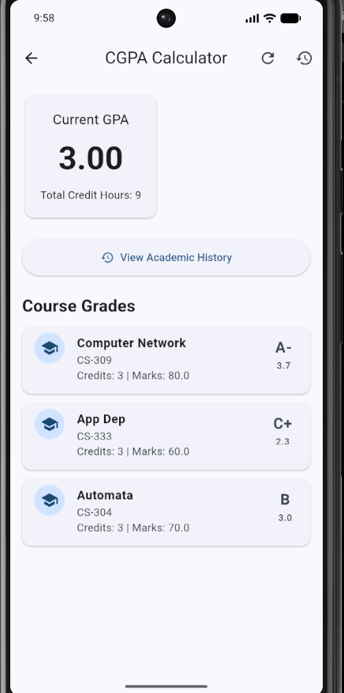
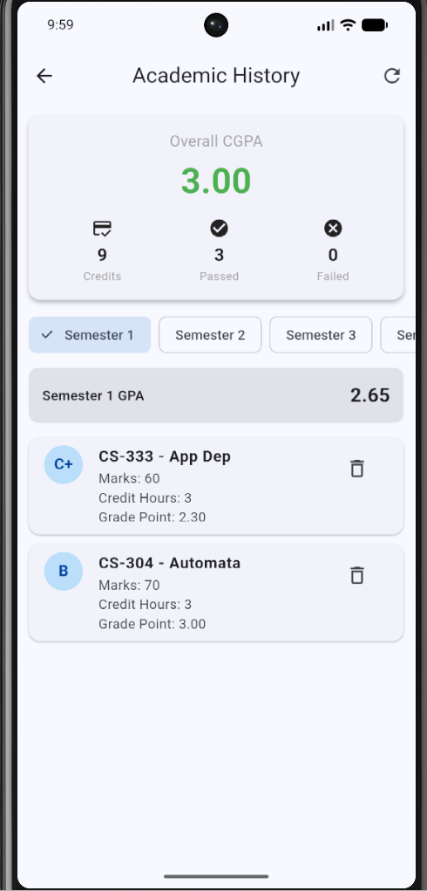
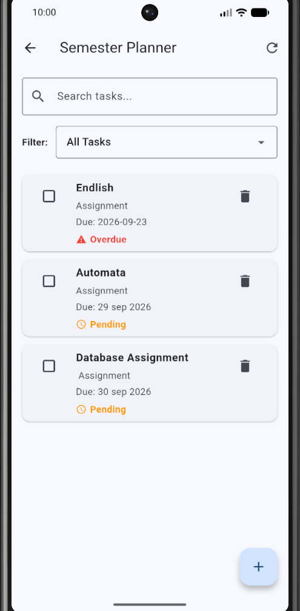
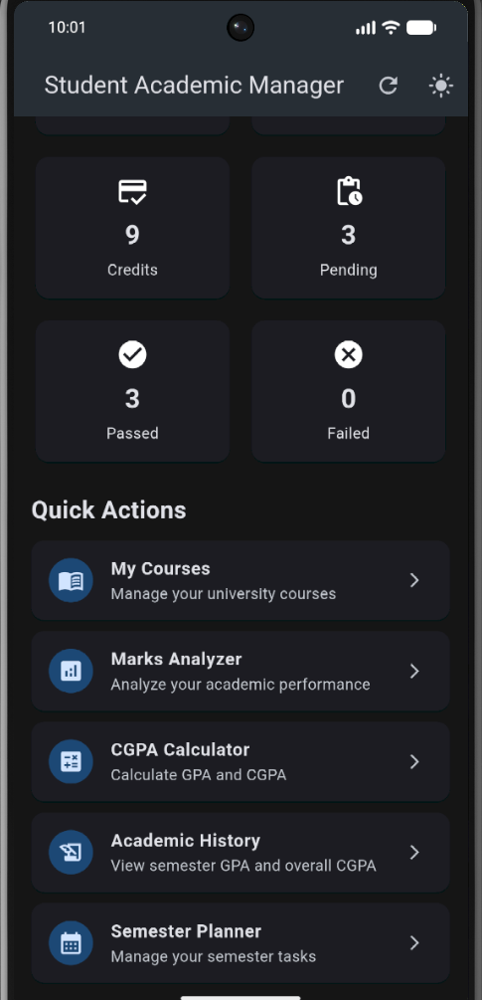

# Student Academic Manager

A Flutter-based mobile application designed to help university students manage their academic information, courses, marks, GPA/CGPA, academic history, and semester tasks in one place.

## 📱 Project Overview

**Student Academic Manager** is a mobile academic management application developed using **Flutter and Dart**.

The application provides students with a centralized platform to:

* Manage courses and course information
* Record marks, grades, credit hours, and instructors
* Analyze academic performance
* Calculate semester GPA and overall CGPA
* View academic history semester-wise
* Manage semester tasks and study planning
* Store academic data locally using SQLite
* Visualize marks using charts
* Switch between Light and Dark Mode

## ✨ Features

### 🎓 Student Dashboard

The dashboard provides a quick overview of the student's academic information:

* Student name
* Roll number
* Current semester
* Degree program
* Overall CGPA
* Total courses
* Total credit hours
* Passed courses
* Failed courses
* Pending tasks

### 📚 Course Management

Students can manage their courses with:

* Course Code
* Course Name
* Credit Hours
* Semester
* Instructor
* Marks
* Grade

Available operations:

* Add course
* Edit course
* Delete course
* Search courses
* Filter courses by semester

### 📊 Marks Analyzer

The Marks Analyzer provides academic performance statistics including:

* Average marks
* Highest marks
* Lowest marks
* Passed courses
* Failed courses
* Course-wise performance
* Semester-wise filtering
* Bar chart visualization

### 🧮 GPA & CGPA Calculator

The application calculates academic performance using credit-hour weighted grade points.

Supported grades include:

* A
* A-
* B+
* B
* B-
* C+
* C
* C-
* D
* F

The application calculates:

* Semester GPA
* Overall CGPA
* Total credit hours
* Passed courses
* Failed courses

### 📖 Academic History

Academic History allows students to review their academic performance semester by semester.

It provides:

* Semester selection
* Semester GPA
* Overall CGPA
* Total credits
* Passed subjects
* Failed subjects
* Course-wise academic records

### 🗓️ Semester Planner

Students can create and manage academic tasks.

The planner supports:

* Add tasks
* Update tasks
* Delete tasks
* Mark tasks as completed
* View pending tasks

### 💾 Local Data Storage

The application uses **SQLite** for local data persistence.

Academic information remains available after closing and reopening the application.

### 🌙 Light & Dark Mode

The application supports both:

* Light Mode
* Dark Mode

## 🛠️ Technologies Used

| Technology       | Purpose                             |
| ---------------- | ----------------------------------- |
| Flutter          | Mobile application development      |
| Dart             | Application programming language    |
| SQLite           | Local database and data persistence |
| fl_chart         | Charts and data visualization       |
| Material Design  | User interface                      |
| Android Emulator | Application testing                 |

## 🏗️ Project Structure

```text
lib/
├── screens/
│   ├── academic_history_screen.dart
│   ├── cgpa_screen.dart
│   ├── courses_screen.dart
│   ├── dashboard_screen.dart
│   ├── marks_screen.dart
│   └── planner_screen.dart
│
├── services/
│   └── storage_service.dart
│
└── main.dart
```

## 🔄 Application Flow

```text
Dashboard
    │
    ├── My Courses
    │      ├── Add Course
    │      ├── Edit Course
    │      └── Delete Course
    │
    ├── Marks Analyzer
    │      └── Performance Charts
    │
    ├── CGPA Calculator
    │      └── Academic History
    │
    └── Semester Planner
           ├── Add Task
           ├── Update Task
           └── Complete Task
```

## 🚀 Getting Started

### Requirements

Before running the project, install:

* Flutter SDK
* Dart SDK
* Android Studio
* Android SDK
* Android Emulator or Android device

### Installation

Clone the repository:

```bash
git clone https://github.com/Ijaz1243/student-academic-manager.git
```

Open the project:

```bash
cd student_academic_manager
```

Install dependencies:

```bash
flutter pub get
```

Run the application:

```bash
flutter run
```

## 🧪 Testing

The application was tested using a Flutter Android Emulator.

Before committing changes, the project was checked using:

```bash
flutter analyze
```

The project currently passes Flutter static analysis with:

```text
No issues found
```

## 📸 Screenshots

### Dashboard



### My Courses



### Marks Analyzer



### CGPA Calculator



### Academic History



### Semester Planner



### Dark Mode



## 🎯 Future Improvements

Possible future improvements include:

* Cloud database synchronization
* Student authentication
* Firebase integration
* PDF academic reports
* Export CGPA/marks reports
* Notifications and reminders
* Attendance management
* Assignment tracking
* Multi-student profiles

## 👨‍💻 Developer

**Muhammad Ijaz Khan**

BS Computer Science Student
University of Engineering and Technology (UET), Peshawar
Khyber Pakhtunkhwa, Pakistan

## 📌 Project Purpose

This project was developed as a practical **Flutter/Dart academic project** to demonstrate mobile application development, local database management, UI design, data visualization, and academic performance calculations.

## 📄 License

This project is created for educational and portfolio purposes.
